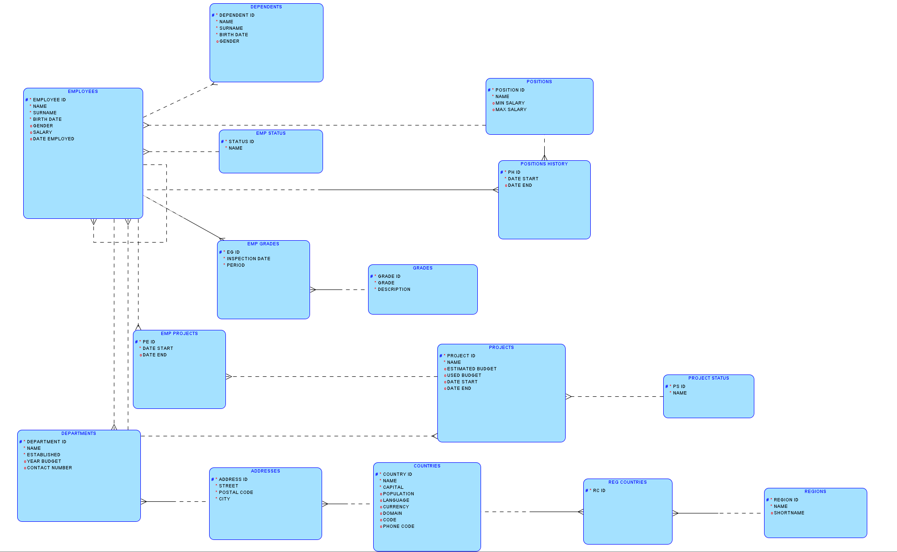
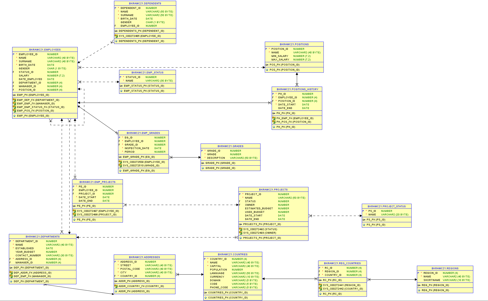

# Bazy Danych - Laboratorium 3 (DML)
## Założenie schematu
> Pobierz skrypt create_schema.sql i uruchom go.

> W Data Modelerze odtwórz model relacyjny i ER utworzonego schematu.



## Ładowanie danych
> Pobierz skrypt insert_data.sql i uruchom go.

## Polecenie `SELECT`
> Wylistuj wszystkie dane z tabeli departments.
```sql
SELECT * FROM departments;
```
> Wylistuj wybrane 3 kolumny z tabeli departments. W jakiej kolejności się pojawią?
```sql
SELECT department_id, name, manager_id
FROM departments;
```
> Zmodyfikuj poprzednie zapytanie tak, aby nazwa zakładu pojawiła się wielkimi literami. Czy ma to wpływ na zawartość tabeli?
```sql
SELECT department_id, UPPER(name), manager_id
FROM departments;
```
> Pokaż id, imię i nazwisko pracowników ich wynagrodzenie oraz przewidywana wartość miesięcznych podatków przez nich płaconych (23%).
```sql
SELECT employee_id, name, surname,salary, 0.23*salary
FROM employees;
```
> Zastosuj alias na kolumnę z podatkiem.
```sql
SELECT employee_id, name, surname,salary, 0.23*salary AS taxes
FROM employees;
```
> Ilu jest wszystkich pracowników?
```sql
SELECT COUNT(*)
FROM employees;
```
> Wylistuj wszystkie imiona pracowników. Ile ich jest?
```sql
SELECT name
FROM employees;

SELECT COUNT(name)
FROM employees;
```
> Wylistuj unikalne imiona pracowników. Ile ich jest?
```sql
SELECT DISTINCT name
FROM employees;

SELECT count(DISTINCT name)
FROM employees;
```

## Polecenie `WHERE`
> Wylistuj wszystkich pracowników, którzy mają zarobki wyższe niż 3000.
```sql
SELECT * FROM employees WHERE salary > 3000;
```
> Wylistuj wszystkich pracowników, którzy mają zarobki między niż 2000 a 3000. Ilu ich jest?
```sql
SELECT * FROM employees WHERE salary BETWEEN 2000 AND 3000;

SELECT COUNT(*) FROM employees WHERE salary BETWEEN 2000 AND 3000;
```
> Wylistuj wszystkich pracowników, którzy mają zarobki między niż 2000 a 3000 i którzy są zatrudnieni po 2010. Ilu ich jest?
```sql
SELECT COUNT(*) FROM employees WHERE salary BETWEEN 2000 AND 3000
AND date_employed > '1/1/2010';

SELECT e.*, EXTRACT(YEAR FROM date_employed) as year_employed FROM employees e;
```
> Wylistuj wszystkich pracowników, którzy płacą podatki mniejsze niż 500.
```sql
SELECT * FROM employees WHERE 0.23*salary < 500;
```
> Pokaż kraje, które zaczynają się na literę “K”.
```sql
SELECT * FROM countries WHERE name LIKE 'K%';
```
> Pokaż pracowników, którzy nie pracują w żadnym zakładzie.
```sql
SELECT * FROM employees WHERE department_id IS NULL;
```
> Pokaż pracowników, którzy pracują w zakładzie o kodzie 102, 103, lub 105.
```sql
SELECT * FROM employees WHERE department_id IN (102, 103, 105);
```
> Pokaż pracowników, którzy nie pracują zakładzie o kodzie 102, 103, lub 105.
```sql
SELECT * FROM employees WHERE department_id NOT IN (102, 103, 105);
```
> Wypisz imię i nazwisko pracowników którzy nie posiadają wynagrodzenia. Zmodyfikuj to zapytanie tak, aby zamiast NULL wypisywało wartość 0.
```sql
SELECT name, surname, nvl(salary, 0) FROM employees WHERE salary IS NULL;

SELECT name, surname FROM employees WHERE salary = 0;
```

## Polecenia `ORDER BY` / `FETCH`
> Pokaż imię i nazwisko 5ciu najlepiej zarabiających pracowników.
```sql
SELECT name, surname, salary
FROM employees
ORDER BY salary DESC NULLS LAST
FETCH NEXT 5 ROWS ONLY;
```

> Pokaż najwcześniej zatrudnionego pracownika
```sql
SELECT * FROM employees ORDER BY date_employed NULLS LAST FETCH NEXT 1 ROWS ONLY;
```

> Pokaż 2 stanowiska na których szerokość widełek (rozpiętość przedziału min płaca - max płaca jest największa)
```sql
SELECT * FROM departments ORDER BY
(SELECT MAX(salary)-MIN(salary) FROM employees WHERE department_id = departments.department_id)
DESC NULLS LAST
FETCH NEXT 2 ROWS ONLY;
```

